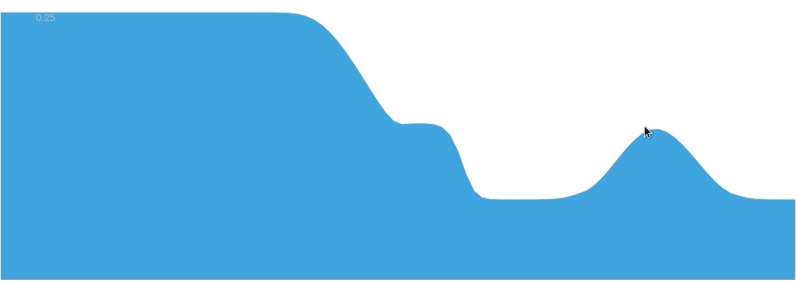

# waterexp

A repository for hosting (hopefully several) interactive JS water experiments. You need a [Chrome](http://www.google.cl/chrome/browser/desktop/index.html) like browser to make it work :).

## [Flume](https://jgalazm.github.io/flume.html)

A one dimensional implementation of a Finite Volume, Roe-type Riemann solver of the Shallow Water Equations without topography variations.
