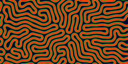
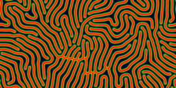

======================
JavaScript Experiments
======================

Some JavaScript experiments. You can see them online using the links below.
`Google Chrome <https://www.google.com/chrome>`_ is the best browser
for these demos, but `Opera <http://www.opera.com>`_ or
Firefox should be fine too.

`Gray-Scott <http://pmneila.github.com/jsexp/grayscott/>`_
==========================================================

`Gray-Scott <http://pmneila.github.com/jsexp/grayscott/>`_
is a solver for the Gray-Scott reaction-diffusion model. Roughly, this
can be seen as a simulation of the behavior of diffusive living beings reproducing
under conditions of limited food. Very different patterns emerge for
slight changes in feeding and death rates.

This experiment uses `Three.js <http://mrdoob.github.com/three.js/>`_
and performs calculations on the GPU.
It requires a WebGL enabled browser.

.. image:: https://github.com/pmneila/jsexp/raw/master/grayscott/grayscott.png
   :align: center
   :target: http://pmneila.github.com/jsexp/grayscott

Screenshots
-----------

Some screenshots of the application.

.. image:: https://github.com/pmneila/jsexp/raw/master/grayscott/snapshots/default_s.png
   :target: https://github.com/pmneila/jsexp/raw/master/grayscott/snapshots/default.png

.. image:: https://github.com/pmneila/jsexp/raw/master/grayscott/snapshots/holes_s.png
   :target: https://github.com/pmneila/jsexp/raw/master/grayscott/snapshots/holes.png

.. image:: https://github.com/pmneila/jsexp/raw/master/grayscott/snapshots/mazes_s.png
   :target: https://github.com/pmneila/jsexp/raw/master/grayscott/snapshots/mazes.png

.. image:: https://github.com/pmneila/jsexp/raw/master/grayscott/snapshots/solitons_s.png
   :target: https://github.com/pmneila/jsexp/raw/master/grayscott/snapshots/solitons.png

.. image:: https://github.com/pmneila/jsexp/raw/master/grayscott/snapshots/solitons2_s.png
   :target: https://github.com/pmneila/jsexp/raw/master/grayscott/snapshots/solitons2.png

.. image:: https://github.com/pmneila/jsexp/raw/master/grayscott/snapshots/spots_s.png
   :target: https://github.com/pmneila/jsexp/raw/master/grayscott/snapshots/spots.png

.. image:: https://github.com/pmneila/jsexp/raw/master/grayscott/snapshots/waves1_s.png
  :target: https://github.com/pmneila/jsexp/raw/master/grayscott/snapshots/waves1.png

.. image:: https://github.com/pmneila/jsexp/raw/master/grayscott/snapshots/waves2_s.png
  :target: https://github.com/pmneila/jsexp/raw/master/grayscott/snapshots/waves2.png

`Particles <http://pmneila.github.com/jsexp/particles/>`_
=========================================================

`Particles <http://pmneila.github.com/jsexp/particles/>`_
is a simple mass-spring physics simulation.

.. image:: https://github.com/pmneila/jsexp/raw/master/particles/particles.png
   :align: center
   :target: http://pmneila.github.com/jsexp/particles
